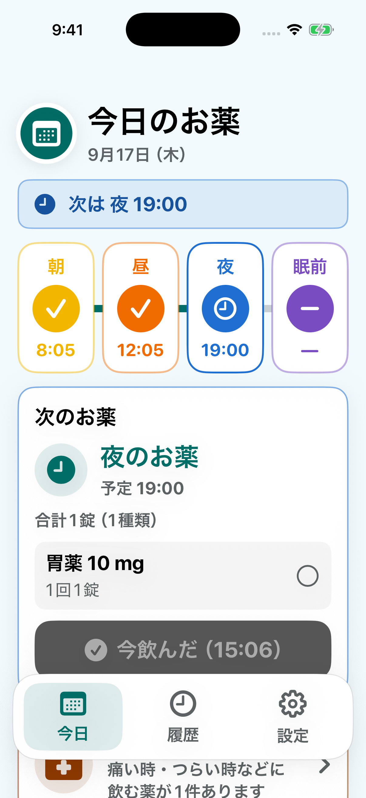
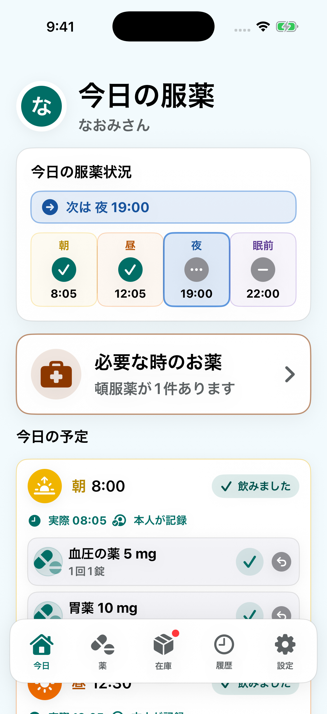
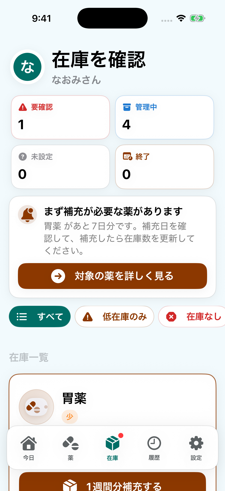

# お薬見守り — プロジェクト紹介

[プロフィールへ戻る](https://github.com/kt-git-1) · [サービス紹介](https://www.okusuri-mimamori.com/) · [App Store](https://apps.apple.com/jp/app/id6787427428)

毎日薬を飲む人と、離れて暮らす家族が服薬状況を共有できるアプリです。薬を飲む人が「飲んだ」と記録すると、見守る家族が服薬状況と薬の残りの量を確認できます。

**個人開発で担当している範囲：** iOSアプリの画面・操作、API、データベース、テスト。App Storeで配信しており、このページでは画面と設計上の工夫を紹介しています。ソースコード本体は非公開です。

## 解決したい課題と使い方

家族が離れて暮らしていると、日々の服薬状況や薬の残りの量を把握しにくくなります。役割に応じた画面で、記録と確認をつなぎます。

1. **見守る家族**が薬と飲む時間を登録し、連携コードで薬を飲む人の端末をつなぎます。
2. **薬を飲む人**が今日飲む薬を確認し、飲んだら記録します。
3. **見守る家族**が服薬状況と薬の残りの量を確認します。

## 利用者に合わせた役割と操作

薬を飲む人にはその日の服薬に必要な操作を、家族には薬・スケジュール・在庫の管理を提供します。画面を分けるだけでなく、APIでも役割と患者単位のアクセス範囲を検証しています。家族の認証と薬を飲む人の端末のセッションを分け、連携コードで接続する構成です。

## 服薬記録と残薬の整合性

誤った服薬記録を取り消す場合、記録だけを消すと残薬が少ないままになります。記録の取消と在庫復元をDBトランザクション内で扱い、取消済みの記録を再度処理しないための更新条件を設けています。

## 利用状況の分析と同意管理

分析処理をサービスに集約し、収集の有効・無効を管理しています。オプトアウト時には分析データをリセットします。画面や操作結果を列挙型で定義し、送信するイベントを管理しています。

## 品質確認

APIの単体・結合・契約・E2Eテストと、iOSのテストを用意しています。CIにはLint・型検査・テスト・ビルドの手順を定義しています。

| 領域 | 使用技術 |
| --- | --- |
| iOS | Swift / SwiftUI |
| API・Web | TypeScript / Next.js / React |
| データ | PostgreSQL / Prisma / Supabase |
| 通知・分析 | APNs / Firebase |
| テスト | Vitest / Playwright / XCTest / GitHub Actions |

## 画面

画面は合成データを使用した開発版です。App Store配信版とは表示が異なる場合があります。

<table>
<tr><th>薬を飲む人の服薬記録</th><th>家族の見守り</th><th>残薬管理</th></tr>
<tr>
<td></td>
<td></td>
<td></td>
</tr>
</table>
